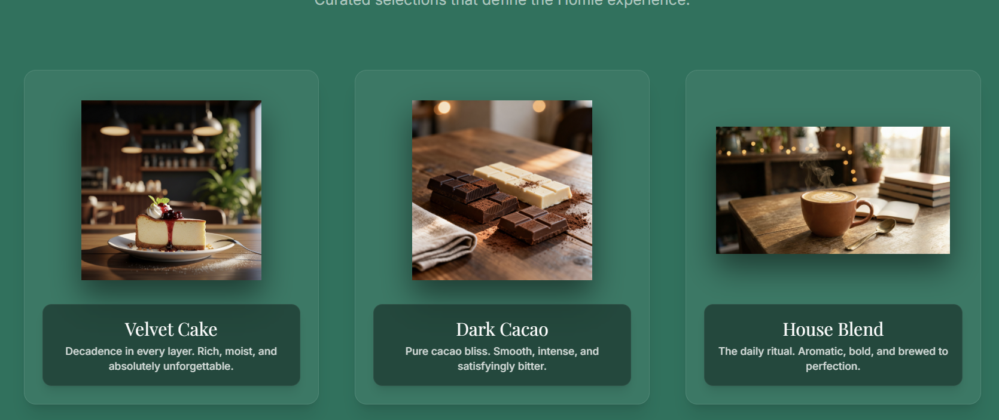
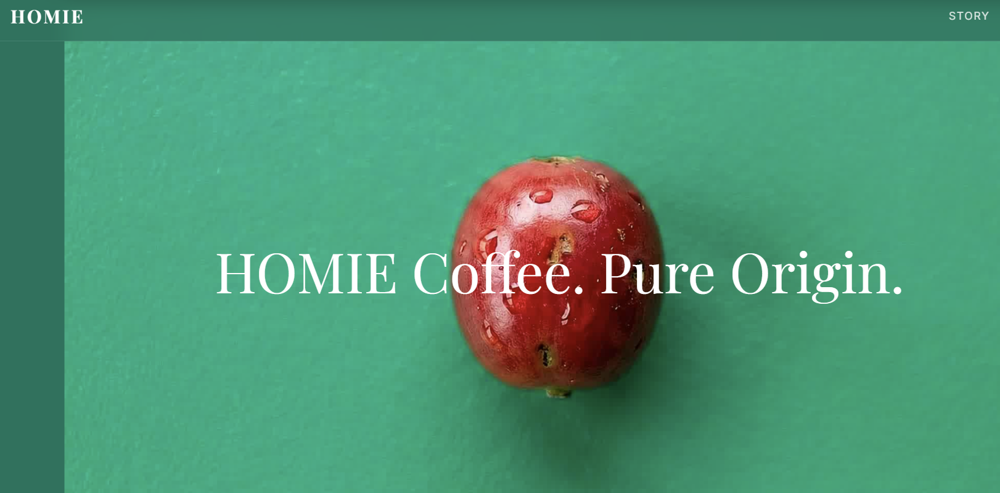
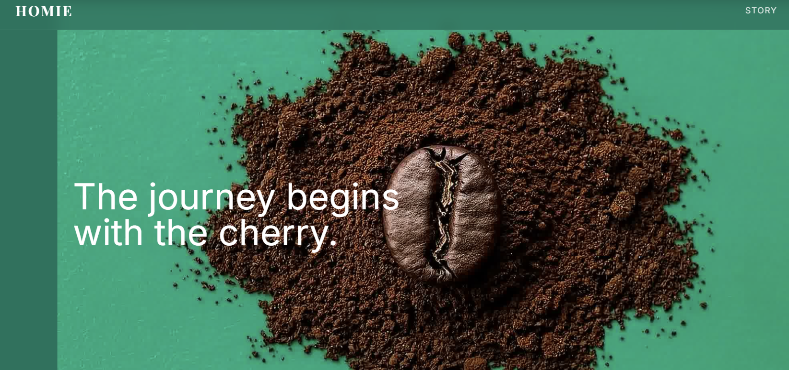

# HOMIE Coffee

HOMIE Coffee is a high-end, immersive web experience designed to showcase the brand's premium coffee offerings through interactive storytelling. The website seamlessly blends advanced web technologies with aesthetic design to create a digital journey that mirrors the quality of the cafe itself.
## 🖼️ Experience Gallery

<p align="center">
  
</p>

<details>
<summary><strong>➡️ View More Screens</strong></summary>

<p align="center">
  
  
</p>

<p align="center">
  
</p>

</details>

## Getting Started

First, run the development server:

```bash
npm run dev
# or
yarn dev
# or
pnpm dev
# or
bun dev
```

Open [http://localhost:3000](http://localhost:3000) with your browser to see the result.

You can start editing the page by modifying `app/page.tsx`. The page auto-updates as you edit the file.

This project uses [`next/font`](https://nextjs.org/docs/app/building-your-application/optimizing/fonts) to automatically optimize and load [Geist](https://vercel.com/font), a new font family for Vercel.

## 🚀 Technology Stack

This project is built using a modern, high-performance web development stack:

- **Next.js 16 (App Router)**: The React framework for production, utilizing Server Components and the latest routing paradigms.
- **React 19**: The latest version of the core UI library.
- **TypeScript**: For static type checking and improved developer experience.
- **Tailwind CSS 4**: A utility-first CSS framework for rapid UI development.
- **Framer Motion**: A production-ready motion library for React, used for:
    - Scrollytelling animations in `CoffeeScroll`.
    - 3D Tilt effects in `ProductCard`.
    - Page transitions and scroll-triggered reveals (`section` animations).
    - Modal interactions (`LocationSection` contact card).
- **Lucide React**: Clean, consistent icon set.

## 📂 Project Structure

The project follows the standard Next.js App Router structure:

```
homie-coffee/
├── public/                 # Static assets
│   └── images/             # Product and sequence images (cake, coffee, frames 1-80)
├── src/
│   ├── app/                # App Router pages and layouts
│   │   ├── layout.tsx      # Root layout (Metadata, Fonts)
│   │   ├── page.tsx        # Homepage (Composition of all sections)
│   │   └── globals.css     # Global styles and Tailwind configuration
│   └── components/         # Reusable UI Components
│       ├── AboutSection.tsx    # Brand story and philosophy
│       ├── CoffeeScroll.tsx    # Core Scrollytelling Engine
│       ├── Footer.tsx          # Site footer
│       ├── LocationSection.tsx # Map, Hours, Directions, Contact Modal
│       ├── MenuSection.tsx     # Curated menu highlight list
│       ├── Navbar.tsx          # Navigation bar (Sticky/Fixed)
│       ├── ProductCard.tsx     # 3D interactive product card component
│       ├── ShowcaseSection.tsx # Grid showcase of signature items
│       └── TextOverlay.tsx     # Narrative text synced with scroll
└── ...config files (tailwind, tsconfig, next, etc.)
```

## 🛠️ Deep Dive: Scrollytelling Implementation

The heart of the website is the **Coffee Lifecycle Sequence**, implemented in `src/components/CoffeeScroll.tsx`.

### How It Works:
1.  **Scroll Container**: The component creates a `div` with a height of `450vh`. This provides enough vertical scroll space to play through the animation without dragging the user away too quickly.
2.  **Sticky Canvas**: Inside this container, an HTML5 `<canvas>` element is set to `sticky top-0`. As the user scrolls through the 450vh container, the canvas remains fixed in the viewport.
3.  **Frame Sequence**: We utilize a sequence of **80 high-resolution JPG frames** (`coffee_frame_1.jpg` to `coffee_frame_80.jpg`) located in `/public/images/sequence/`.
4.  **Preloading**: On mount, the component asynchronously preloads all 80 images into browser memory (`HTMLImageElement[]`) to ensure 60fps playback without flickering or network lag during interaction.
5.  **Scroll Mapping**:
    - We use `framer-motion`'s `useScroll` hook to track the user's progress through the container (0.0 to 1.0).
    - This progress is mathematically mapped to the frame index (1 to 80).
    - Example: 50% scroll progress ≈ Frame 40.
6.  **Rendering**: On every scroll event (change in `scrollYProgress`), the canvas context clears and draws the specific image frame corresponding to the current scroll position.
7.  **Responsiveness**: The canvas logic includes `object-contain` simulation to ensure the image sequence scales correctly on both mobile and desktop screens without distortion, respecting the device's pixel ratio (Retina displays).

## ☕ Cafe Information & Vibe

HOMIE Coffee isn't just a cafe; it's a sanctuary for coffee lovers.

### The Brand Story
> "More than just coffee."

HOMIE started with a simple belief: **coffee connects us**. From the farmers who nurture the cherry to the baristas who pour the art, every step is a handshake. We roast small batches to highlight the unique character of every bean, ensuring that what ends in your cup is pure origin magic.

### Signature Offerings
Our menu is a curated mix of purist brews and comfort delights:
-   **The OG Latte**: Double shot, silky milk, signature latte art.
-   **Velvet Cold Brew**: Nitrogen-infused, steeped for 24 hours.
-   **Matcha Cloud**: Ceremonial grade matcha with vanilla foam.
-   **Espresso Tonic**: A bright, refreshing mix of acidity and botanicals.
-   **Strawberry Delight**: A fresh, pink, berry-infused favorite.

### Visit Us
**Address**:
Lane 7, Koregaon Park
Pune, Maharashtra 411001

**Hours**:
-   **Mon - Fri**: 7:00 AM - 7:00 PM
-   **Sat - Sun**: 8:00 AM - 6:00 PM

**Contact**:
-   📞 9356773269
-   ✉️ cafe.gmail.com
-   📸 @cafename

### Navigation Features
-   **Get Directions**: One-click navigation that opens Google Maps directly to our doorstep.
-   **Contact Card**: An elegant, glassmorphic pop-up for quick access to our contact details.

## Learn More

To learn more about Next.js, take a look at the following resources:

- [Next.js Documentation](https://nextjs.org/docs) - learn about Next.js features and API.
- [Learn Next.js](https://nextjs.org/learn) - an interactive Next.js tutorial.

You can check out [the Next.js GitHub repository](https://github.com/vercel/next.js) - your feedback and contributions are welcome!

## Deploy on Vercel

The easiest way to deploy your Next.js app is to use the [Vercel Platform](https://vercel.com/new?utm_medium=default-template&filter=next.js&utm_source=create-next-app&utm_campaign=create-next-app-readme) from the creators of Next.js.

Check out our [Next.js deployment documentation](https://nextjs.org/docs/app/building-your-application/deploying) for more details.  make this reade file very attractive and nbeautiful and all 
